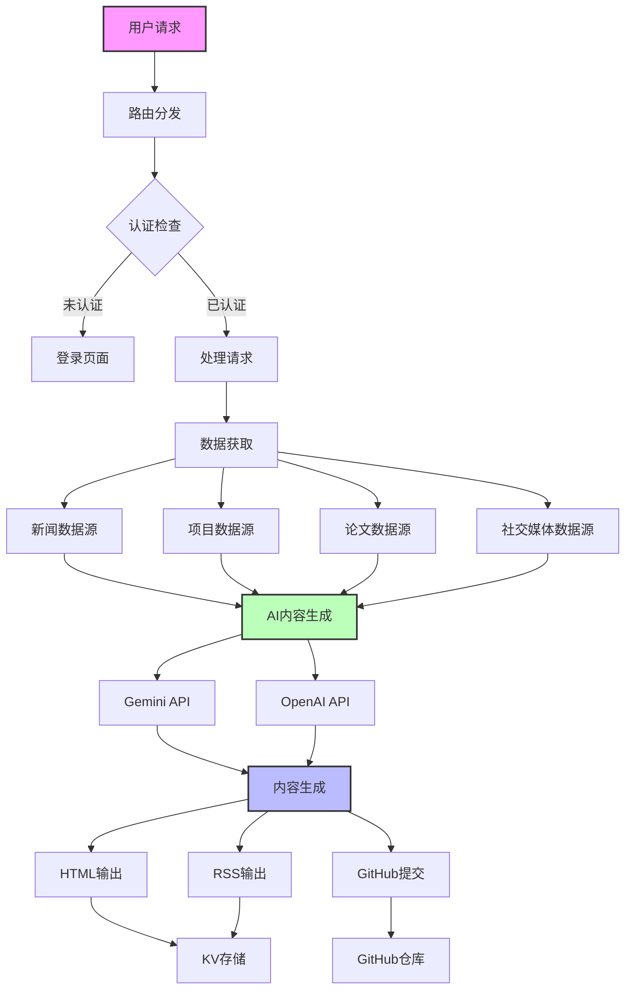
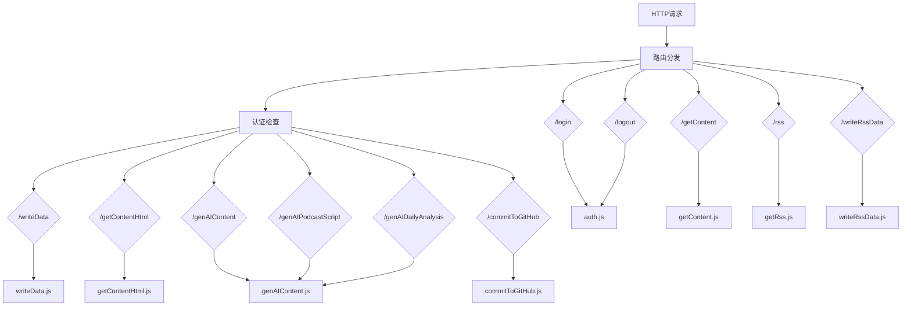
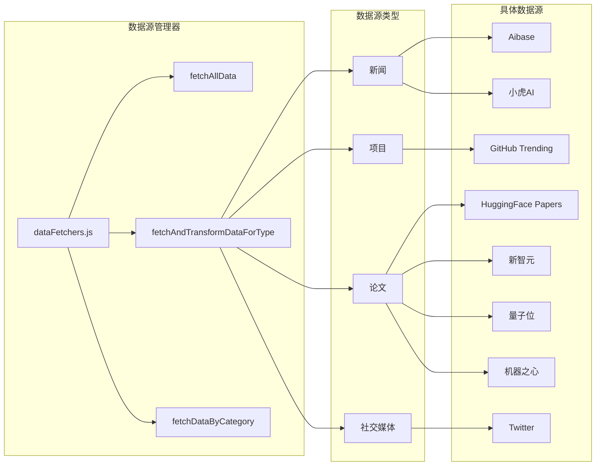
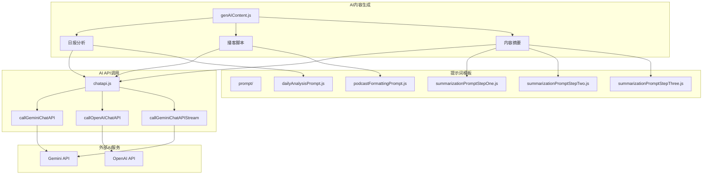
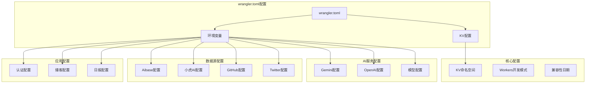
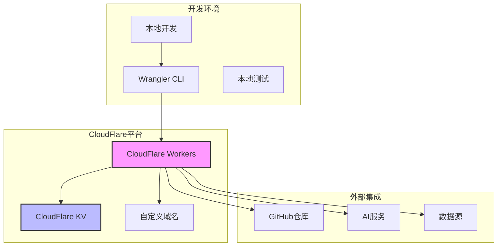

# CloudFlare AI Insight Daily 系统架构

## 系统概述

CloudFlare AI Insight Daily 是一个基于 CloudFlare Workers 的 AI 日报生成系统，能够自动收集、分析和生成 AI 相关的内容，包括新闻、项目、论文和社交媒体信息。

## 整体架构图

```mermaid
graph TB
    %% 外部服务
    subgraph "外部服务"
        CF[CloudFlare Workers]
        KV[CloudFlare KV]
        GitHub[GitHub API]
        Gemini[Gemini API]
        OpenAI[OpenAI API]
    end

    %% 数据源
    subgraph "数据源"
        AIBASE[Aibase]
        XIAOHU[小虎AI]
        GITHUB[GitHub Trending]
        HF[HuggingFace Papers]
        XZY[新智元]
        QBIT[量子位]
        JQZX[机器之心]
        TWITTER[Twitter]
    end

    %% 核心组件
    subgraph "核心组件"
        INDEX[index.js - 主入口]
        AUTH[auth.js - 认证模块]
        CHATAPI[chatapi.js - AI API调用]
        DATAFETCHERS[dataFetchers.js - 数据获取]
        HELPERS[helpers.js - 工具函数]
        HTMLGEN[htmlGenerators.js - HTML生成]
    end

    %% 处理器
    subgraph "处理器 Handlers"
        WRITEDATA[writeData.js]
        GETCONTENT[getContent.js]
        GETHTML[getContentHtml.js]
        GENAICONTENT[genAIContent.js]
        COMMIT[commitToGitHub.js]
        RSS[getRss.js]
        WRITERSS[writeRssData.js]
    end

    %% 数据源模块
    subgraph "数据源模块 DataSources"
        DS_AIBASE[aibase.js]
        DS_XIAOHU[xiaohu.js]
        DS_GITHUB[github-trending.js]
        DS_HF[huggingface-papers.js]
        DS_XZY[xinzhiyuan.js]
        DS_QBIT[qbit.js]
        DS_JQZX[jiqizhixin.js]
        DS_TWITTER[twitter.js]
    end

    %% 提示词模块
    subgraph "提示词模块 Prompts"
        PROMPT_DAILY[dailyAnalysisPrompt.js]
        PROMPT_PODCAST[podcastFormattingPrompt.js]
        PROMPT_SUM1[summarizationPromptStepOne.js]
        PROMPT_SUM2[summarizationPromptStepTwo.js]
        PROMPT_SUM3[summarizationPromptStepThree.js]
    end

    %% 连接关系
    CF --> INDEX
    INDEX --> AUTH
    INDEX --> DATAFETCHERS
    INDEX --> WRITEDATA
    INDEX --> GETCONTENT
    INDEX --> GETHTML
    INDEX --> GENAICONTENT
    INDEX --> COMMIT
    INDEX --> RSS
    INDEX --> WRITERSS

    DATAFETCHERS --> DS_AIBASE
    DATAFETCHERS --> DS_XIAOHU
    DATAFETCHERS --> DS_GITHUB
    DATAFETCHERS --> DS_HF
    DATAFETCHERS --> DS_XZY
    DATAFETCHERS --> DS_QBIT
    DATAFETCHERS --> DS_JQZX
    DATAFETCHERS --> DS_TWITTER

    GENAICONTENT --> CHATAPI
    GENAICONTENT --> PROMPT_DAILY
    GENAICONTENT --> PROMPT_PODCAST
    GENAICONTENT --> PROMPT_SUM1
    GENAICONTENT --> PROMPT_SUM2
    GENAICONTENT --> PROMPT_SUM3

    CHATAPI --> Gemini
    CHATAPI --> OpenAI

    AUTH --> KV
    WRITEDATA --> KV
    COMMIT --> GitHub

    DS_AIBASE --> AIBASE
    DS_XIAOHU --> XIAOHU
    DS_GITHUB --> GITHUB
    DS_HF --> HF
    DS_XZY --> XZY
    DS_QBIT --> QBIT
    DS_JQZX --> JQZX
    DS_TWITTER --> TWITTER

    style CF fill:#f9f,stroke:#333,stroke-width:2px
    style INDEX fill:#bbf,stroke:#333,stroke-width:2px
    style CHATAPI fill:#bfb,stroke:#333,stroke-width:2px
```

## 数据流架构

## 模块详细架构

### 1. 主入口模块 (index.js)

### 2. 数据源架构

### 3. AI处理架构

## 配置架构

## 部署架构

## 技术栈

- **运行时**: CloudFlare Workers
- **存储**: CloudFlare KV
- **AI服务**: Gemini API, OpenAI API
- **数据源**: 多个AI新闻和论文平台
- **部署**: Wrangler CLI
- **认证**: 基于Cookie的会话管理
- **输出**: HTML, RSS, GitHub提交

## 主要特性

1. **多数据源聚合**: 支持多个AI相关数据源的自动收集
2. **AI内容生成**: 使用大语言模型生成日报、播客脚本等
3. **多格式输出**: 支持HTML、RSS、GitHub提交等多种输出格式
4. **认证系统**: 基于会话的用户认证
5. **可扩展架构**: 模块化设计，易于添加新的数据源和功能 